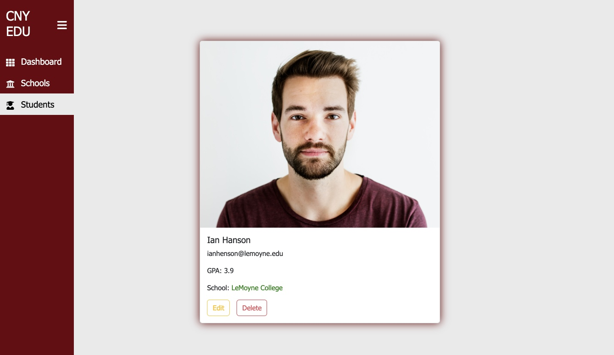
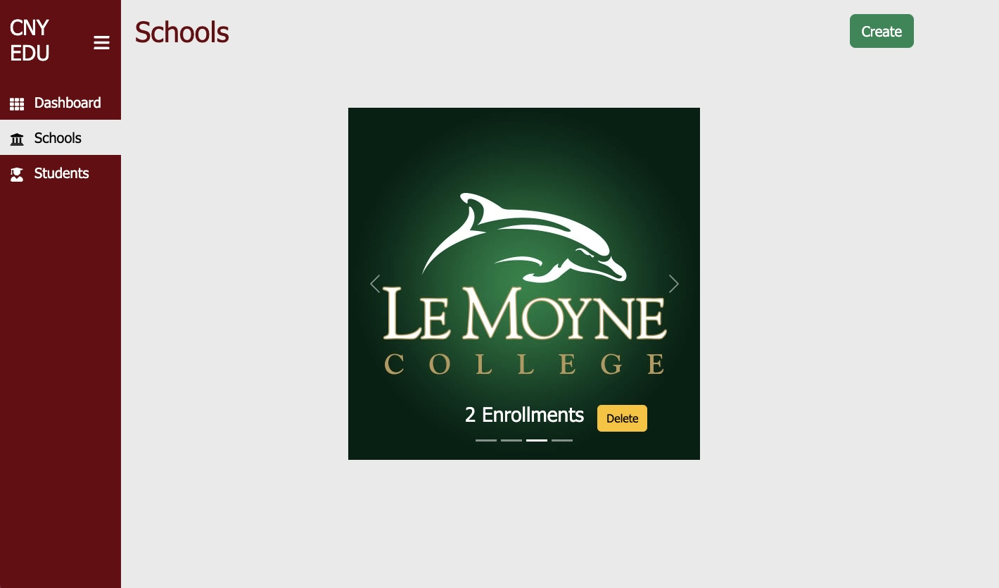
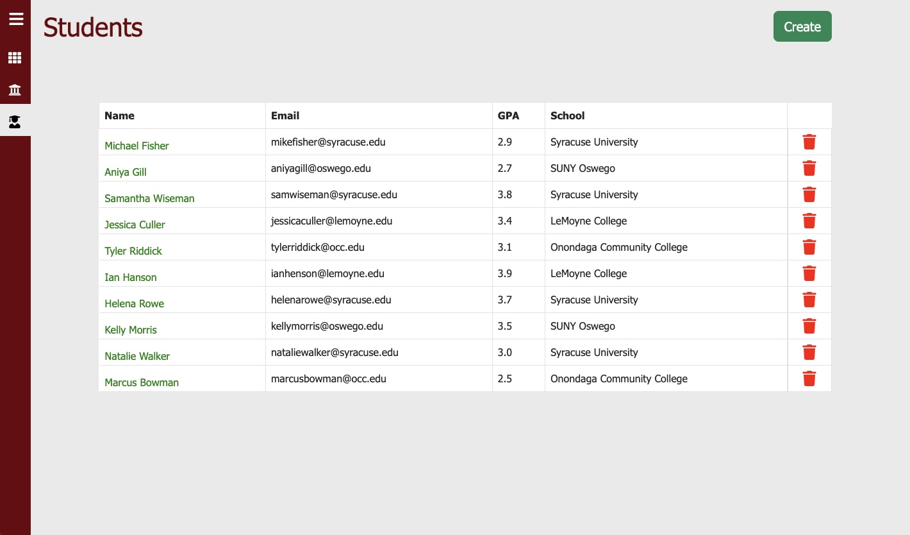
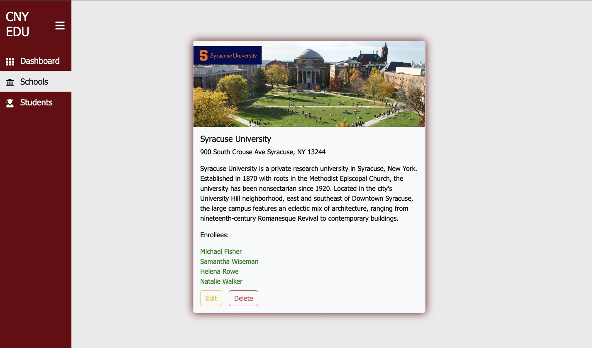
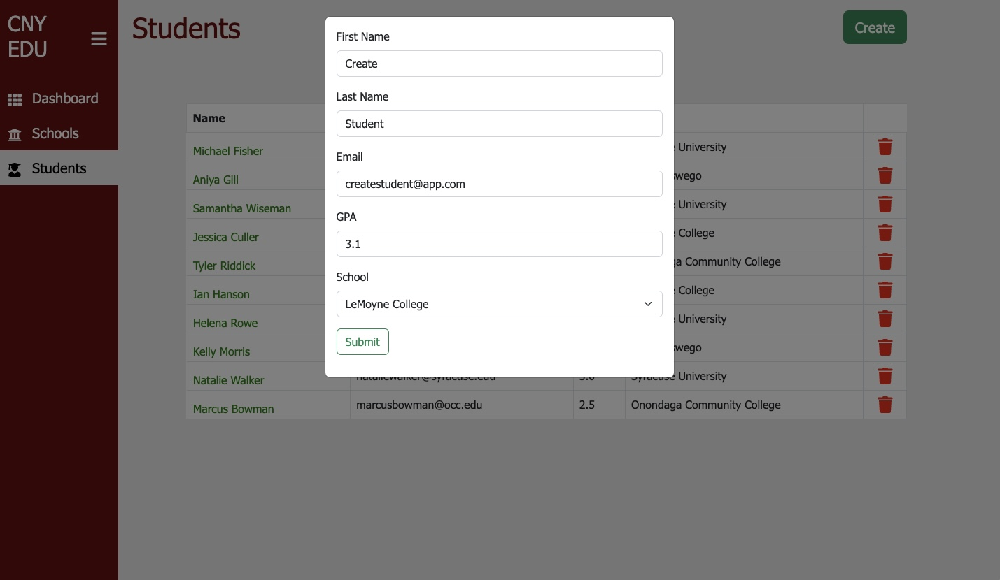
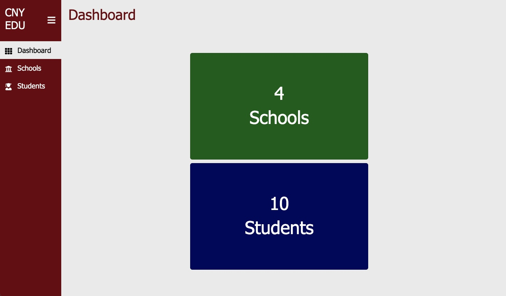

<h1 align="center">Campus and Student Admin Dashboard Project 🎓</h1>

## 👨‍💻 About The Project

Developed a comprehensive admin dashboard to bolster administrative efficiency and content management.

## 🛠️ Built With

This application was built utilizing a collection of technologies including but not limited to:

* JavaScript
* React
* Redux
* Node.js
* Express
* PostgreSQL
* Sequelize

## 📖 Features

* Dynamic Data Management: Provides the ability to create, edit, and delete campus and student profiles, giving administrators full control over data.
* Custom Campus Affiliations: An administrative feature that allows for the assignment and modification of custom campus affiliations, enhancing data accuracy and flexibility.
* Intuitive User Interface: Designed with usability in mind, the dashboard makes navigation and data manipulation easy and efficient.
* Comprehensive Reporting: Integrated reporting tools allow administrators to quickly access, analyze, and export data for further examination or sharing.

## 📸 Snapshot of the Project

---

---

---

---

---

